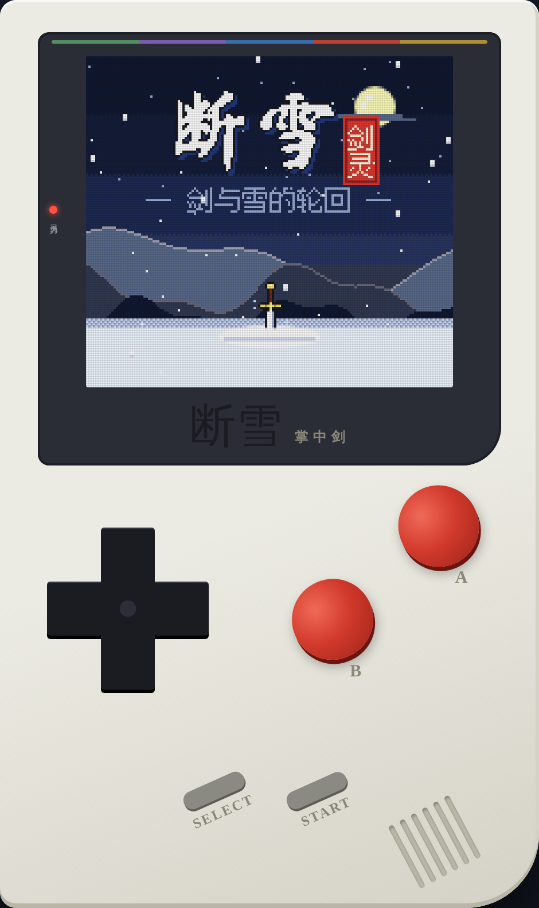
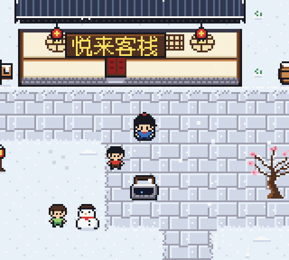
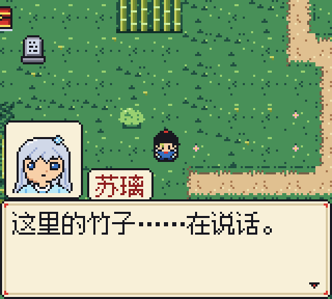
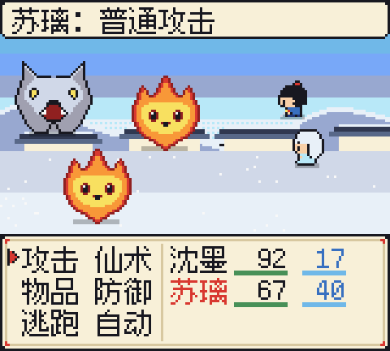
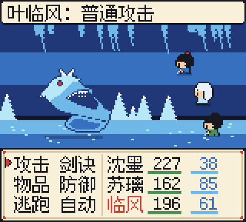
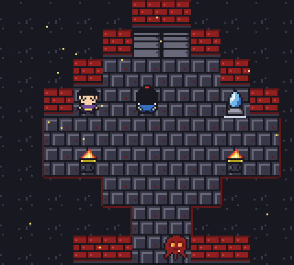

# 断雪 · 掌中剑

一款仿 Game Boy Color 风格的中文武侠 RPG，纯原生 JavaScript 编写，在浏览器里就能玩。

<p align="center">
  
</p>

> 三百年前，有一位剑仙，以一柄剑，镇住了魔。
> 后来，剑断了。
> 再后来，就没有人记得了。

你扮演青石镇剑铺学徒 **沈墨**。一个雪夜，他遇见了雪中剑灵 **苏璃**，从此踏上收集五灵、重铸断剑「断雪」的旅程。

## 特色

- **地道的 GBC 规格**：160×144 分辨率，整数倍像素缩放，每个 8×8 格子遵守颜色数量限制，带可开关的 LCD 网格。
- **全部美术由代码生成**：角色、图块、战斗立绘都以字符画的形式写在 `js/art_*.js` 里，运行时绘制，没有任何图片素材。
- **芯片音乐**：仿 GBC 声卡（2 路方波 + 1 路波形 + 1 路噪声），用小型 MML 方言写成的五声调式原创配乐。
- **像素中文字体**：从 Fusion Pixel 12px 中只提取游戏用到的字形，打包成位图。
- **五灵相克战斗**：条件回合制（CTB），风、雷、水、火、土循环相克（水克火、火克风、风克雷、雷克土、土克水），Boss 会先蓄力预告大招。
- **断剑重铸**：每吸收一种灵，「断雪」淬炼一次，攻击力提高，沈墨也学会对应属性的剑招。
- **完整流程**：序章到终章共 6 章、29 张地图，包括竹林迷踪、冰面滑行谜题、镇妖塔封印机关等。
- **双结局**：收集全部 5 片「雪忆」可以看到真结局。
- **掌机外壳**：页面画出一台掌机，带可触控的十字键和 A/B/START/SELECT；横屏设备或连接手柄时可以切换成只显示屏幕的「掌机模式」。

## 游戏截图

<table>
  <tr>
    <td align="center"><br>标题画面</td>
    <td align="center"><br>青石镇</td>
    <td align="center"><br>剧情对话</td>
  </tr>
  <tr>
    <td align="center"><br>回合制战斗</td>
    <td align="center"><br>Boss 战：冰蛟</td>
    <td align="center"><br>镇妖塔</td>
  </tr>
</table>

## 快速开始

### 直接玩

打开 `dist/duanxue.html` 或 `dist/test.html` 即可，两者都是单文件，所有脚本已内联：

- `dist/duanxue.html`：只包含 `<title>`、样式、页面结构和脚本，供会自动套上 `<html>/<head>/<body>` 的托管环境（如 Claude Artifact）使用。
- `dist/test.html`：同样的内容外面加了完整的 HTML 骨架，可以直接用浏览器打开。

### 从源码运行

游戏不依赖任何构建工具或框架，`index.html` 用普通的 `<script>` 标签按顺序加载 `js/` 下的脚本。建议起一个本地静态服务器：

```bash
python3 -m http.server 8000
# 浏览器访问 http://localhost:8000/
```

## 操作

| 动作 | 键盘 | 手柄 | 触屏 |
| --- | --- | --- | --- |
| 移动 | 方向键 / WASD | 十字键 / 左摇杆 | 十字键 |
| 确认 | Z / J / 空格 | A（按键 0） | A |
| 取消 / 按住奔跑 | X / K / Esc | B（按键 1、2） | B |
| 菜单 | Enter | START（按键 9） | START |
| SELECT | Shift / Backspace | SELECT（按键 8） | SELECT |

- 长按 SELECT 约 1.2 秒，或点页面下方的「掌机模式」按钮，可以在掌机外壳和纯屏幕之间切换。
- 在纯屏幕模式下点一下画面会进入全屏。
- 嵌在其他页面里时，先点一下画面，键盘输入才会生效。

## 存档与设置

所有数据都存在浏览器的 `localStorage` 里：

| 键 | 内容 |
| --- | --- |
| `duanxue.save.1` ~ `3` | 三个存档槽（随时可以在菜单「存档」里保存；灵石处还会回满气血和真气） |
| `duanxue.settings` | 文字速度、屏幕网格 |
| `duanxue.muted` | 是否静音 |
| `duanxue.mode` | 外壳 / 掌机模式 |
| `duanxue.cleared` | 通关记录（`normal` / `true`） |

清除浏览器的站点数据会同时清掉存档。

## 目录结构

```
.
├── index.html          # 开发入口：掌机外壳 + 按顺序加载 js/
├── js/
│   ├── core.js         # 画面、主循环、输入（键盘/手柄/触屏）、后期效果
│   ├── gfx.js          # 绘图工具
│   ├── font.js         # 像素字体渲染
│   ├── font_data.js    # 字形位图（由 tools/build_font.py 生成）
│   ├── audio.js        # 芯片音源
│   ├── music.js        # 配乐与音效
│   ├── art_*.js        # 角色、图块、战斗、界面、标题书法的像素数据
│   ├── state.js        # 存档数据结构
│   ├── data.js         # 角色、技能、道具、敌人、遇敌表
│   ├── ui.js           # 对话框、选项框等界面组件
│   ├── field.js        # 地图、行走、NPC、事件、天气
│   ├── battle.js       # 战斗系统
│   ├── fx.js           # 战斗特效
│   ├── menu.js         # 菜单、存读档、设置、商店、客栈
│   ├── story_util.js   # 宝箱、灵石、铸剑、雪忆等剧情工具
│   ├── scenes.js       # 标题、序幕、章节卡、结局
│   ├── ch0_town.js     # 序章·雪夜（青石镇）
│   ├── ch1_bamboo.js   # 第一章·青竹（翠竹林）
│   ├── ch2_mountain.js # 第二章·栖云（山道、栖云派）
│   ├── ch3_cave.js     # 第三章·寒潭（冰洞）
│   ├── ch4_tower.js    # 第四章·镇妖（镇妖塔）
│   ├── ch5_end.js      # 终章·归墟（剑冢、结局）
│   ├── shell.js        # 掌机外壳的缩放布局与触控
│   ├── main.js         # 启动入口
│   ├── dev.js          # 开发跳关点与测试辅助（不打包）
│   └── stubs.js        # 开发期占位（不打包）
├── dist/               # 打包好的单文件版本
├── docs/               # 应用图标（由 tools/make_icons.py 生成）与 README 截图
└── tools/              # 构建、校验、模拟脚本
```

## 开发

### 构建

```bash
# 把 index.html + js/*.js 打包成 dist/duanxue.html（不含 dev.js、stubs.js）
python3 tools/bundle.py

# 新增或修改了中文文本后，重新提取字形，生成 js/font_data.js
python3 tools/build_font.py

# 重新生成 docs/ 下的应用图标
python3 tools/make_icons.py
```

注意：`build_font.py` 会扫描 `js/` 下所有脚本里的非 ASCII 字符。只要文本里出现了新的汉字，就要重新运行它，否则这个字会显示不出来。

### 校验与模拟

以下脚本需要 Node.js，会在 Node 的 VM 里加载游戏脚本运行：

```bash
node tools/validate.js      # 检查图块、角色、战斗图的尺寸和调色板（COLORS=1 时列出超色的格子）
node tools/checkmaps.js     # 检查地图：行宽、未知图块、传送点落脚处、NPC/宝箱位置
node tools/reach.js         # 静态可达性：从入口出发能否走到出口、宝箱、NPC 和触发点
node tools/icesolve.js <地图> <起点x> <起点y> <终点x> <终点y>   # 冰面滑行谜题求解
node tools/sim.js [次数] [Boss名]   # 用机器人自动打 Boss 战，统计胜率、回合数、残血
node tools/simenc.js        # 按各区域预期等级模拟随机遇敌，估算练级节奏
```

`reach.js` 只做静态分析，不认识机关开门之类的逻辑。比如镇妖塔里要先点亮封印才能上楼，这类楼梯会被报告为不可达，需要人工判断是不是误报。

调数值时可以用 `setstats.py` 快速改 `js/data.js` 里某个敌人的属性：

```bash
python3 tools/setstats.py wolfking hp=180 atk=14
```

### 调试参数

从源码运行（`index.html`）时，可以通过 URL 参数跳过流程：

| 参数 | 作用 |
| --- | --- |
| `?jump=<名称>` | 跳到预设进度点：`night`、`bridge`、`ch1`、`ch2`、`gate`、`ch3`、`cave3`、`ch4`、`top`、`ch5`、`final`（定义在 `js/dev.js`） |
| `?map=<地图>&x=&y=` | 直接进入某张地图 |
| `?battle=<敌人,...>` | 直接开始一场战斗，可配合 `lv=`、`party=suli,linfeng`、`sword=`、`bg=`、`boss` |
| `?big` | 不显示外壳，4 倍大画面，同时启用测试辅助函数 |
| `?dev` | 启用测试辅助函数（`go`、`act`、`press`、`walkTo`、`autoOn` 等） |
| `?auto` | 配合 `big`/`dev` 使用，自动推进对话、自动选战斗指令 |
| `?solo` 或 `#screen` | 强制进入掌机模式 |

`tools/gallery.html` 会平铺所有美术资源，方便预览（可以用 `?only=chars|tiles|battle`、`?s=缩放` 筛选）。`tools/titlebake.html` 用来把毛笔字体烘焙成标题用的像素点阵。

## 致谢与许可

- 像素字体：[Fusion Pixel Font](https://github.com/TakWolf/fusion-pixel-font)（12px，SIL OFL 1.1），其字形还来自方舟像素字体、俐方体11号、Galmuri。各字体的许可证见 `tools/font-license/`。
- 掌机外壳页面使用的字体：Google Fonts 上的 [Ma Shan Zheng](https://fonts.google.com/specimen/Ma+Shan+Zheng) 和 [Noto Serif SC](https://fonts.google.com/noto/specimen/Noto+Serif+SC)。
- 游戏代码、美术和音乐目前还没有声明开源许可证。
